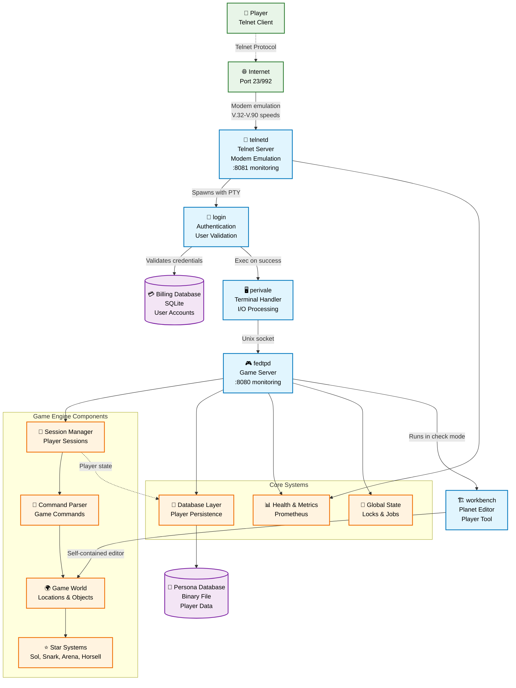

# Federation: 1999 - System Architecture

This diagram illustrates how the various programs in the Federation: 1999 codebase work together to create a multi-user text-based space trading game.

## Program Descriptions

### **telnetd** 📡
- **Purpose**: Telnet server that accepts incoming connections
- **Features**: Handles PROXY protocol, PTY management, terminal settings, authentic 1990s modem emulation
- **Modem Speeds**: V.32 (9.6K), V.32bis (14.4K), V.32terbo (19.2K), V.34 (28.8K/33.6K), V.90 (56K)
- **Monitoring**: Health checks on port 8081
- **Key Role**: Entry point with period-appropriate connection experience

### **login** 🔐
- **Purpose**: Authentication system with security features
- **Features**: Password validation, login attempt limiting
- **Database**: Uses SQLite billing database for account management
- **Security**: Implements backoff delays and attempt limits

### **perivale** 🖥️
- **Purpose**: Terminal I/O handler and protocol processor
- **Features**: Non-blocking I/O, terminal formatting, spy/trace protocols
- **Communication**: Uses Unix domain sockets to connect to game server
- **Role**: Bridges between terminal display and game logic

### **fedtpd** 🎮
- **Purpose**: Main game server with multiplayer session management
- **Features**: Command processing, game world simulation, player persistence
- **Architecture**: Event-driven with global locks for consistency
- **Monitoring**: Health checks and Prometheus metrics on port 8080

### **workbench** 🏗️
- **Purpose**: Self-contained planet creation, editing, and validation tool
- **Features**: Interactive planet design with built-in validation logic
- **Integration**: Used by fedtpd in check-only mode to validate player planets before loading

## Data Flow

1. **Connection**: Player connects via telnet to port 23/992
2. **Authentication**: telnetd spawns login process for credential validation
3. **Session Setup**: login execs perivale which connects to fedtpd via Unix socket
4. **Game Loop**: Commands flow through perivale ↔ fedtpd, with responses formatted for terminal
5. **Persistence**: Player state automatically saved to binary persona database
6. **Monitoring**: Health checks and metrics exposed for operational visibility

## Key Features

- **Multi-user**: Concurrent player sessions with session management
- **Persistent World**: Binary database maintains game state between sessions
- **Security**: Rate limiting, and secure authentication
- **Monitoring**: Health checks and Prometheus metrics for observability
- **Single-server**: Designed for vertical scaling (bigger hardware) typical of 1999 era
